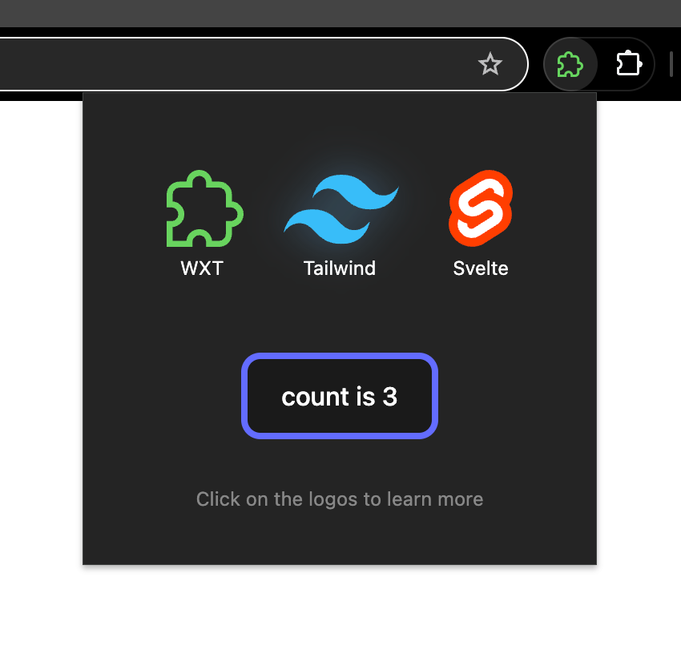

# WXT + Svelte + Tailwind

Tailwind + Svelte 4 + WXT boilerplate.

Based on the WXT Svelte setup at https://wxt.dev/get-started/introduction.

Also check out https://github.com/wxt-dev/wxt.

<!--  -->

## Recommended IDE Setup

[VS Code](https://code.visualstudio.com/) + [Svelte](https://marketplace.visualstudio.com/items?itemName=svelte.svelte-vscode).
